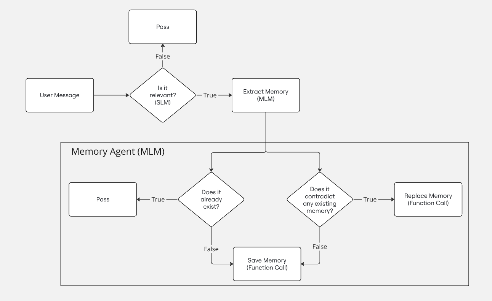

# Memory for Virtual Companion

## Introduction

*A Step Towards AI-Driven Old Age Care*

This project aims to create an advanced memory module that works seamlessly with large language models. By allowing long-term memory storage, the module enables the AI companion to remember and recall key details about the user's life, creating more personalized and meaningful interactions.

The primary focus is on enhancing old age care, addressing challenges such as social isolation and loneliness among the elderly. The virtual companion acts as a conversational partner, providing companionship and emotional support. Additionally, this project aims to address cognitive decline by recording and regularly updating memories with timestamps. Future versions will include a medication reminder system, providing timely notifications and follow-ups to ensure the treatment plan is being followed.

- [Memory for Virtual Companion](#memory-for-virtual-companion)
  - [Introduction](#introduction)
  - [Proposed System](#proposed-system)
    - [Overview of the System](#overview-of-the-system)
    - [Why This Approach?](#why-this-approach)
  - [Guide to Code](#guide-to-code)
    - [1. Install Dependencies](#1-install-dependencies)
    - [2. Cache Necessary Models](#2-cache-necessary-models)
    - [3. Core Classes](#3-core-classes)
    - [4. Processing Flow](#4-processing-flow)
    - [5. Customizations](#5-customizations)

## Proposed System

<p align="center">
  
  <br>
  <em>System for extracting, saving and replacing memories</em>
</p>

### Overview of the System

This updated flow diagram encapsulates the entire process of how the Memory Agent operates, combining relevance checking, memory extraction, and memory management.

1. **Relevance Check**:

- The system begins by evaluating the user's message to determine if it is relevant and worth remembering. 

- To ensure quick decisions, a small language model (SLM), microsoft/Phi-3.5-mini-instruct, is utilized. Its lightweight design enables efficient processing without compromising task accuracy.

2. **Memory Extraction**:

- If the message is deemed relevant, it proceeds to the memory extraction stage.

- A more capable memory language model (MLM), Qwen/Qwen2.5-7B-Instruct, is used here. This model excels at understanding complex instructions and extracting meaningful details, ensuring structured and insightful memory entries.

3. **Memory Management**:

- *Existence Check*: The agent checks whether the extracted memory already exists in the database.

- *Contradiction Check*: If the new memory conflicts with existing information, the system intelligently resolves the conflict by replacing outdated or contradictory memories.

- *Save Memory*: If the memory is new and doesn't contradict existing knowledge, it is stored directly.

- *Replace Memory*: When contradictions are detected, the conflicting memory is updated or replaced to maintain the integrity of the system's knowledge base.

### Why This Approach?
This streamlined system leverages the strengths of both small and large language models to achieve a balance between speed and accuracy. Additionally, the memory agent ensures consistency and adaptability by managing conflicts and replacing outdated information, making the system dynamic and capable of learning over time.

## Guide to Code

### 1. Install Dependencies

```
pip install -r requirements.txt
```

### 2. Cache Necessary Models

```
from utils import cache_models

cache_models()
```

### 3. Core Classes

- The main logic resides in `engine.py`, which contains three classes:
  - `JudgementGenerator`: Handles relevance checks for user messages.
  - `MemoryGenerator`: Extracts meaningful details from relevant messages.
  - `MemoryAgent`: Manages memory storage, conflict resolution, and updates.

### 4. Processing Flow

- Relevance Check:
  - Pass the user's message to `get_judgement()` from the `JudgementGenerator` class.

- Memory Extraction:
  - If the judgement is positive (True), pass the message to `get_memory()` from the `MemoryGenerator` class.

- Agent Decision:
  - The extracted memory is passed to `get_agent_decision()` from the `MemoryAgent` class.
  - Based on the decision, the agent will respond with:
    - `NONE`: No action required.
    - Function call: `save_memory` (for new memories).
    - Function call: `replace_memory` (for conflicting or outdated memories).

### 5. Customizations

- Consider upgrading the model used in the `MemoryAgent` to a larger one if computational resources allow. Models with >13 billion parameters are recommended.
- If using fine-tuned models for function calling, you might need to adjust the prompt used by the `MemoryAgent` for optimal results.