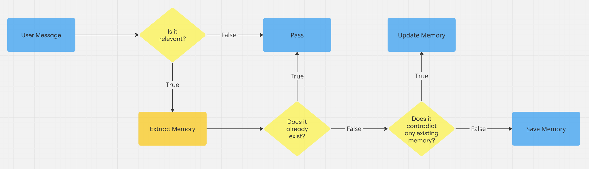
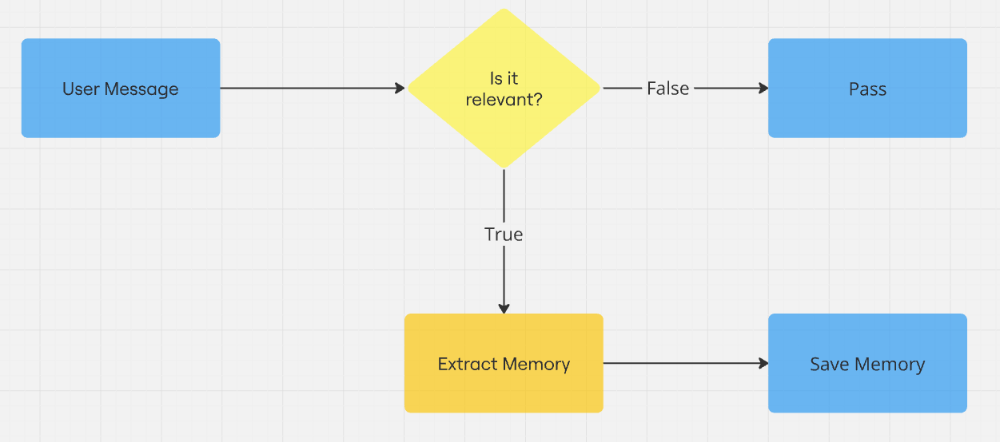

# Memory for Virtual Companion

## Introduction

*A Step Towards AI-Driven Old Age Care*

This project aims to create an advanced memory module that works seamlessly with large language models. By allowing long-term memory storage, the module enables the AI companion to remember and recall key details about the user's life, creating more personalized and meaningful interactions.

The primary focus is on enhancing old age care, addressing challenges such as social isolation and loneliness among the elderly. The virtual companion acts as a conversational partner, providing companionship and emotional support. Additionally, this project aims to address cognitive decline by recording and regularly updating memories with timestamps. Future versions will include a medication reminder system, providing timely notifications and follow-ups to ensure the treatment plan is being followed.

- [Memory for Virtual Companion](#memory-for-virtual-companion)
  - [Introduction](#introduction)
  - [Memory Flow Process](#memory-flow-process)
  - [Relevance and Extraction](#relevance-and-extraction)

## Memory Flow Process

  
   
  <em>Proposed flow for the Memory Module</em>

**How It Works**:

1. **Relevance Check**:
The system evaluates the user's message to determine if it contains important or relevant information worth storing as a memory.

2. **Memory Extraction**:
If relevant, key details are extracted from the message.

3. **Existence Check**:
The system checks if the memory already exists in its database.

4. **Contradiction Check**: If the memory is new, the system verifies that it does not conflict with existing memories. In case of a conflict, the memory is updated to maintain accuracy and consistency.

This process ensures that the virtual companion can effectively manage and recall user-specific information, providing a more interactive and supportive experience.

## Relevance and Extraction

  
   
  <em>The first half of the flow representing relevence checking and memory extraction</em>

1. **Receiving the User's Message**: The process begins when the system receives a message from the user, which is then analyzed for relevance to determine if it contains information worth remembering.

2. **Relevance Check**: The model used for this decision is `microsoft/Phi-3.5-mini-instruct`, a lightweight language model with only 3 billion parameters. This model is chosen for its efficiency and quick decision-making capabilities, making it ideal for initial relevance checks.

    - Future Plan: The system aims to replace this with a fine-tuned `BERT` classification model trained on synthetic data for better accuracy and task-specific performance.

3. **Memory Extraction**: If the message is deemed relevant, it is passed to a larger model, `Qwen/Qwen2.5-7B-Instruct`, which performs detailed memory extraction. The larger model is employed for its advanced understanding of instructions and ability to generate well-structured outputs.

    - Future Plan: Currently, the model is selected based on GPU power limitations. However, the long-term objective is to integrate a more advanced, larger model to further improve comprehension and task performance.

By dividing tasks between smaller and larger models, this approach ensures a balance between speed and accuracy, optimizing the system for efficient memory processing.